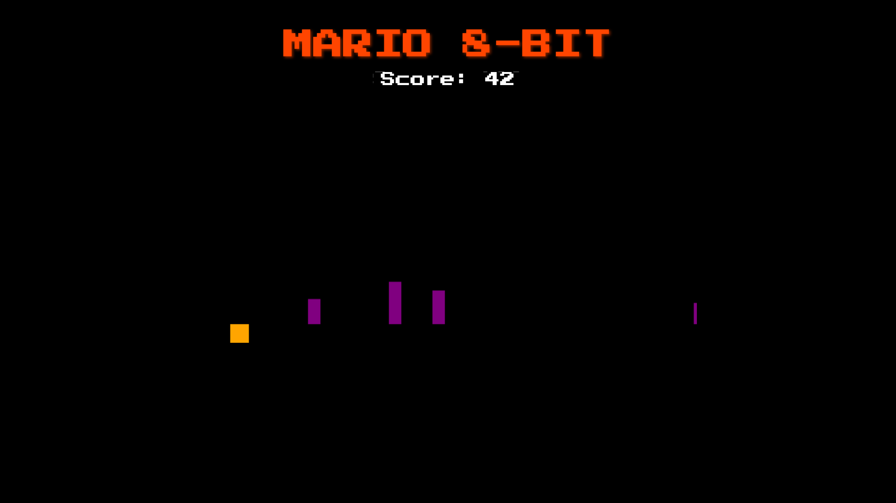
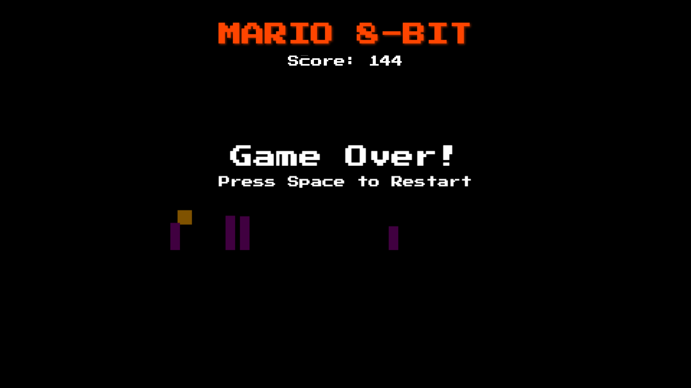

<div align="center">
  <a href="https://hkhaira.github.io/mario-8-bit/" style="display: inline-block; padding: 20px 40px; font-size: 32px; font-weight: bold; text-decoration: none; color: black; background-color: #FF4500; border-radius: 8px; margin-bottom: 20px;">PLAY NOW</a>
</div>

# Mario 8-Bit Jump Game 🎮

A simple yet fun 8-bit style jumping game built with JavaScript and HTML5 Canvas. Jump over obstacles, score points, and try to beat your own record!

---

## Table of Contents

- [Features](#features)
- [How to Play](#how-to-play)
- [Installation & Running the Game](#installation--running-the-game)
  - [Using the Node.js Server](#using-the-nodejs-server)
  - [Running Locally Without a Server](#running-locally-without-a-server)
- [Development](#development)
- [Screenshots](#screenshots)
- [Contributing](#contributing)
- [License](#license)
- [Support](#support)

---

## Features

- **Retro Graphics:** 8-bit style visuals for a nostalgic gaming experience.
- **Simple Controls:** Use the space bar to jump and restart.
- **Progressive Difficulty:** Faster obstacles and increasing challenge over time.
- **Score Tracking:** Watch your high score improve as you dodge obstacles.

---

## How to Play

1. **Starting the Game:** The game automatically starts when loaded.
2. **Jump:** Press **SPACE** (or tap the screen on mobile devices) to jump over obstacles.
3. **Avoid Obstacles:** Purple obstacles will appear; don't collide with them!
4. **Restarting:** When you get hit, the game will show a "Game Over" screen. Press **SPACE** or tap the screen to restart.

---

## Installation & Running the Game

### Prerequisites

- [Node.js](https://nodejs.org/en/) (for running the local server)
- A modern web browser (Chrome, Firefox, Safari, or Edge)

---

### Using the Node.js Server

This option is ideal if you want to run the game on a local server.

1. **Clone the Repository:**

    ```bash
    git clone https://github.com/yourusername/mario-8-bit.git
    cd mario-8-bit
    ```

2. **Install the Dependencies:**

    ```bash
    npm install
    ```

3. **Start the Server:**

    ```bash
    npm start
    ```

    By default, the server listens on port **3000** (or another port if specified in your `server.js`). You should see a message in the terminal such as:

    ```
    Game running at http://localhost:3000
    ```

4. **Open the Game in Your Browser:**

    Open [http://localhost:3000](http://localhost:3000) in your web browser.

---

### Running Locally Without a Server

If you prefer to run the game without setting up a Node server, you can:

1. Simply open the `index.html` file in your favorite web browser.
2. Note that certain features (like live-reloading or logging) might be limited when running as a static file.

---

## Development

If you'd like to modify or enhance the game, here are the main files you'll work with:

- **`index.html`**  
  Contains the layout for the game. It now includes a stylish title and score display.

- **`game.js`**  
  Holds all the game logic, such as drawing the player/enemies, handling collisions, and updating the game state.

- **`server.js`**  
  A simple Express.js server used to serve the game during development. You can modify the port or add extra middleware if needed.

- **`README.md`**  
  This file, which contains complete instructions and details about the project.

After editing your code, simply refresh the page in your browser (or restart the server) to see changes.

---

## Screenshots

Below are sample screenshots of the game:


*The game start screen with the title and score.*


*Example of the Game Over screen.*

*Note: Add your own screenshots in a `screenshots/` folder and update the image paths as needed.*

---

## Contributing

Contributions are welcome! Follow these guidelines:

1. **Fork the Repository**
2. **Create a New Branch:**

    ```bash
    git checkout -b feature/YourFeatureName
    ```

3. **Commit Your Changes:**

    ```bash
    git commit -m "Describe your changes"
    ```

4. **Push to the Branch:**

    ```bash
    git push origin feature/YourFeatureName
    ```

5. **Open a Pull Request**

Please ensure your code is well documented and follows existing coding conventions.

---

## License

This project is licensed under the MIT License. See the [LICENSE](LICENSE) file for details.

---

## Support

If you have any questions or issues with the project, please open an issue on the GitHub repository or contact the maintainer.

---

Made with ❤️ by Happy!